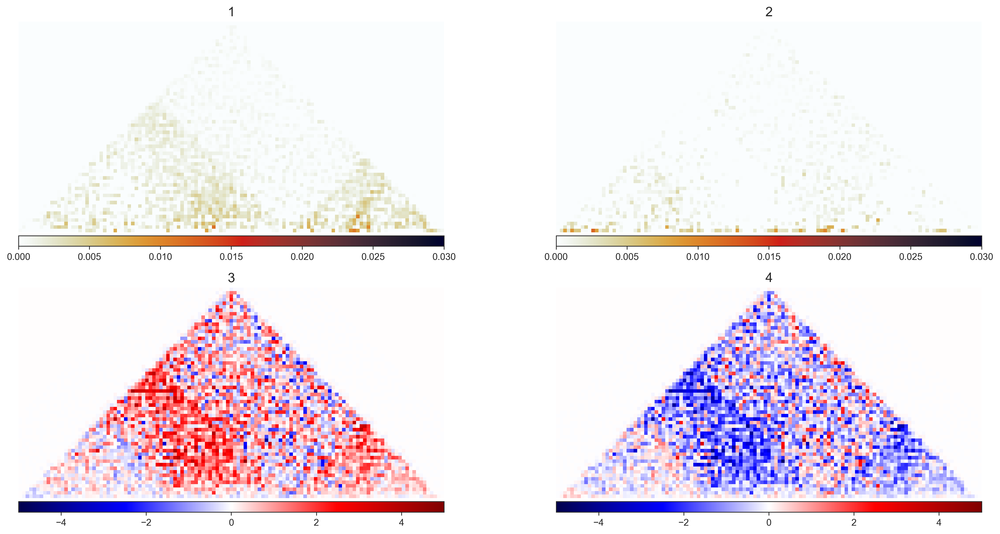
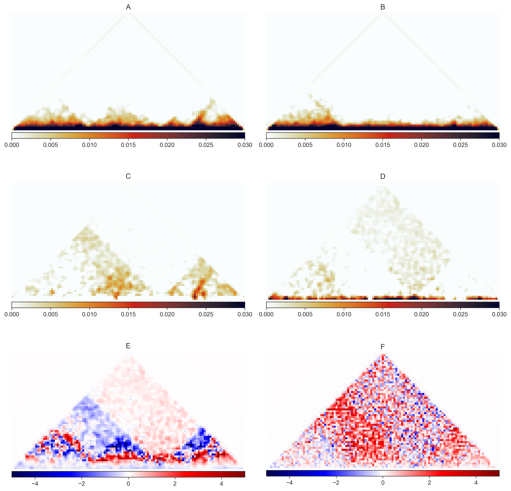
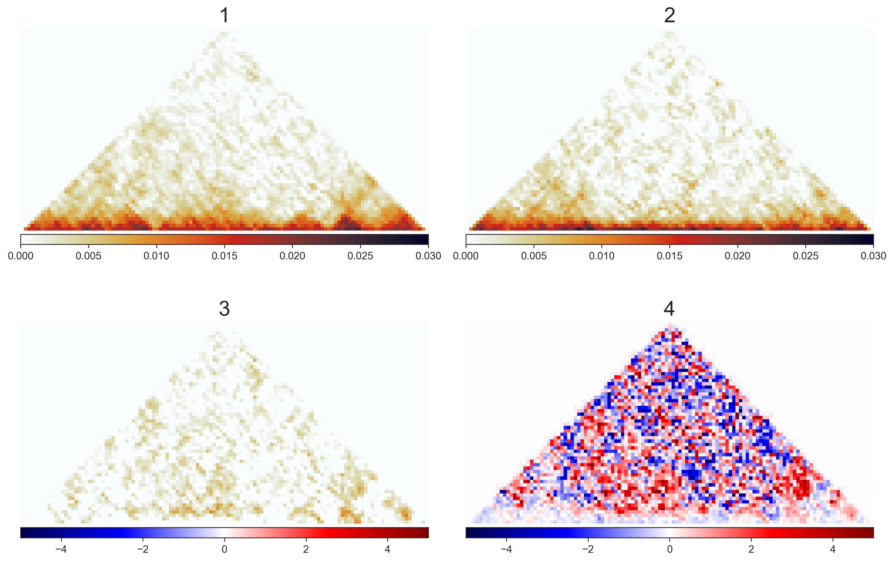
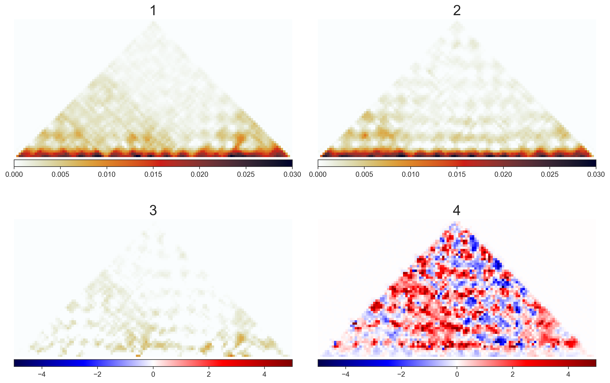
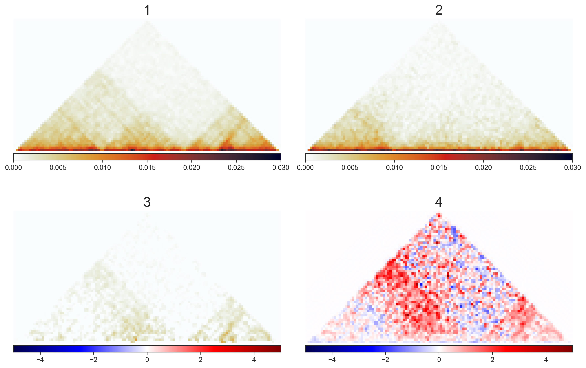
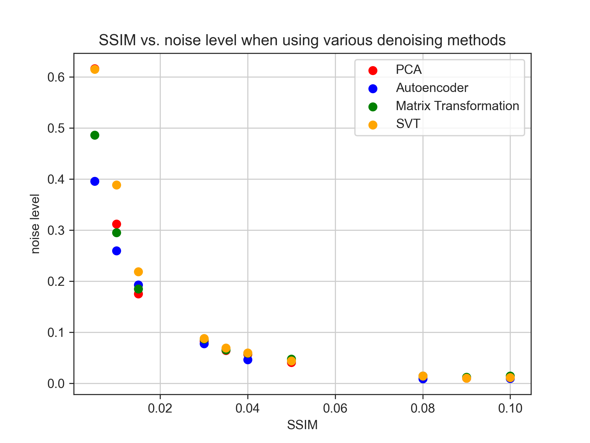

## all plots from hic experiments
this dir contains all the plots from following hic experiments. see the sample outputs below and their captions.

every experiment is outlined below. the following experiments are applied onto the dlbcl dataset:
* `simple_diff` - takes simple diff of two hic matrices to expose areas of difference.
* `pca_hic` - applies pca to hic matrix1 and matrix2. reduces noise on the matrices before comparing them. includes stat to determine which window size best eliminates noise.
* `autoencoder_hic` - applies autoencoder to hic matrices to remove noise. autoencoder is trained on original matrix and used to denoise the query matrix. 
* `matrix_transformation_hic` 
* `singular_value_threshold_hic`

### dlbcl dataset info
using data with chromatin conformation changes in B-cells of a diffuse large B-cell lymphoma (DLBCL) patient.
The bounding boxes are generated by feeding windows of 3 Mb window size, stepping 100 kb in to the CHESS extract pipeline. The below experiments perform denoising operations on chr2 of the data. The hic data produces a 121x121 matrix when loaded into computer memory. [Data Availability](https://en.wikipedia.org/wiki/Diffuse_large_B-cell_lymphoma)

* original data

Figure 1  
caption:  
Figure 1.1: raw data of patient dlbcl sample from chess with red bounding boxes representing gained features from control sample  
Figure 1.2: raw data of control dlbcl sample from dlbcl with blue bounding boxes representing lost features that did not carry over to patient  
Figure 1.3: simple diff of patient - control  
Figure 1.4: log2(patient/control)  

* `pca_hic`

Figure 2  
caption:  
figure below is from using 3x3 window size stepping 1 unit. it also has a n_components param of 0.95, meaning features can explain 95% of variance.  
Figure 2.1: PCA applied to on patient  
Figure 2.2: PCA applied to control  
Figure 2.3: Difference of PCA patient - control  
Figure 2.4: log transformation of PCA applied patient/control  

stats for patient dataset
- RMSE: 0.0008698776305886675
- SSIM: 0.9455008878561836
- Explained Variance: 0.9791310059549767
   
stats for control dataset
- RMSE: 0.0010030784322756757
- SSIM: 0.931176674663269
- Explained Variance: 0.9786093352737302

* `autoencoder_hic`

Figure 3  
caption:  
figure below is from using latent space or encoding dimension of 40.  
Figure 3.1: autoencoder applied onto patient sample  
Figure 3.2: autoencoder applied onto control sample  
Figure 3.3: autoencoder applied patient - control  
Figure 3.4: log transformation of autoencoder applied patient / control  

stats for patient
- RMSE: 0.003268624836516338
- SSIM: 0.5603837090570739
- Explained Variance: 0.7053439802088456
   
stats for control
- RMSE: 0.004033890547864682
- SSIM: 0.4292017638059828
- Explained Variance: 0.6540683637257909

* `matrix_factorization_hic`

Figure 4  
caption:  
figure below is using a n_components size of 15.  
Figure 4.1: mf applied onto patient sample  
Figure 4.2: mf applied onto control sample  
Figure 4.3: mf applied patient - control  
Figure 4.4: log transformation of mf applied patient / control  

stats for patient
- RMSE: 0.002808144378972066
- SSIM: 0.8017047363074518
- Explained Variance: 0.7825176204503851
   
stats for control
- RMSE: 0.0036945295982092788
- SSIM: 0.7096551058333078
- Explained Variance: 0.7098164730735839

* `singular_value_threshold_hic`

Figure 5  
caption:  
figure below is from using a threshold of 0.04.  
Figure 5.1: svt applied onto patient sample  
Figure 5.2: svt applied onto control sample  
Figure 5.3: svt applied patient - control  
Figure 5.4: log transformation of svt applied patient / control  

stats for patient
- RMSE: 0.002485035109289444
- SSIM: 0.8781677258370684
- Explained Variance: 0.8326963633963829
   
stats for control
- RMSE: 0.0026973264071887834
- SSIM: 0.8805868416864833
- Explained Variance: 0.847643967056996

### noise added to dlbcl data
in this experiment, noise is added with gaussian blur layers to the dlbcl data. the experiments are conducted to see how well it removes the manually added noise.

* original data
noise added to original data in increments

Figure 6  
caption:  
- first row is patient data with increasing noise
- second row is control data with increasing noise 

stats:  

* `pca_hic` 

Figure 7  
caption:  
- first row is pca applied onto patient noise data
- second row is pca applied onto control noise data
- third row is diff of respective pca applied patient - control 

stats:  

* `autoencoder_hic`

Figure 8  
caption:  
- first row is autoencoder applied onto patient noise data
- second row is autoencoder applied onto control noise data
- third row is autoencoder of respective pca applied patient - control 

stats:  

* `mf_hic`

Figure 9  
caption:  
- first row is autoencoder applied onto patient noise data
- second row is autoencoder applied onto control noise data
- third row is autoencoder of respective pca applied patient - control 

stats:  

* `svt_hic`

Figure 10  
caption:  
- first row is autoencoder applied onto patient noise data
- second row is autoencoder applied onto control noise data
- third row is autoencoder of respective pca applied patient - control 

stats:  

* `noise_plot`

Figure 11  
caption:  
- plot of increasing noise on x axis and stats on y axis of sim for different experiments.

stats:  