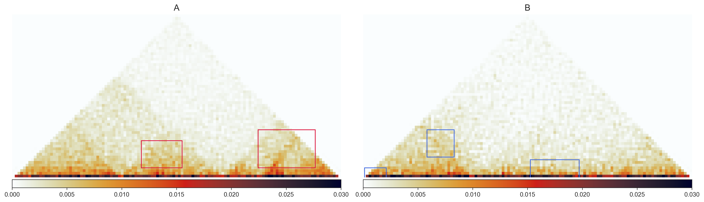
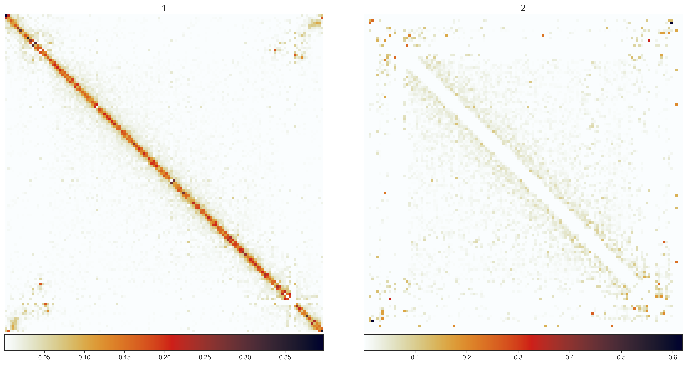
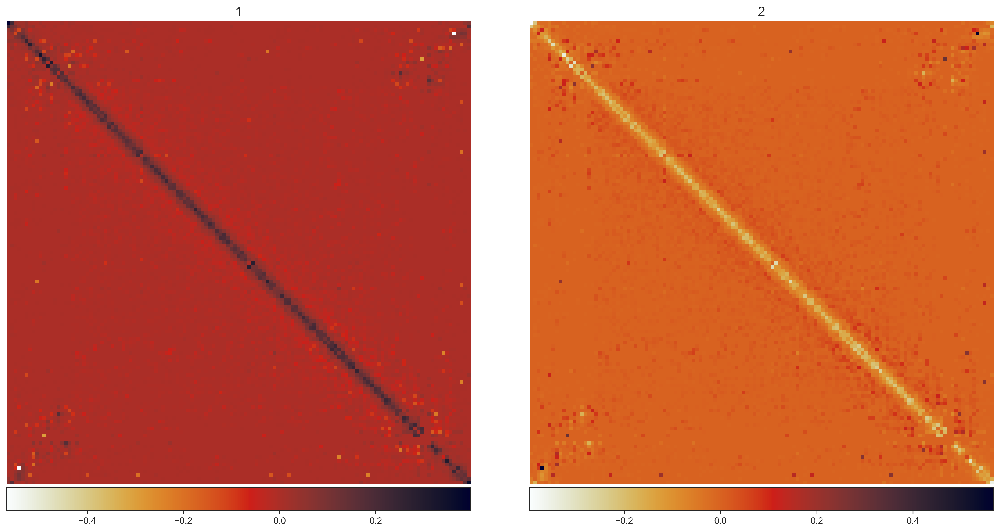
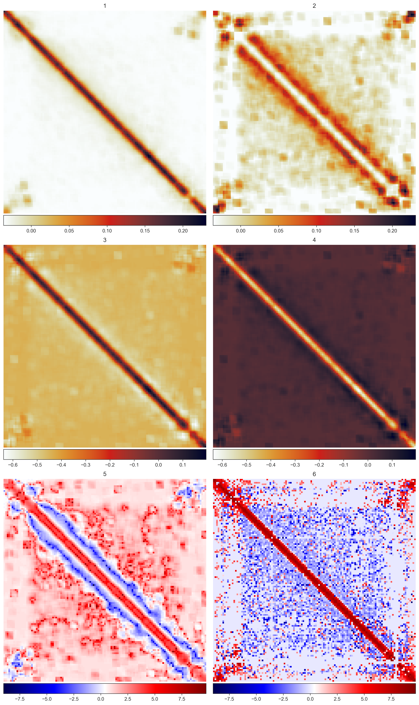
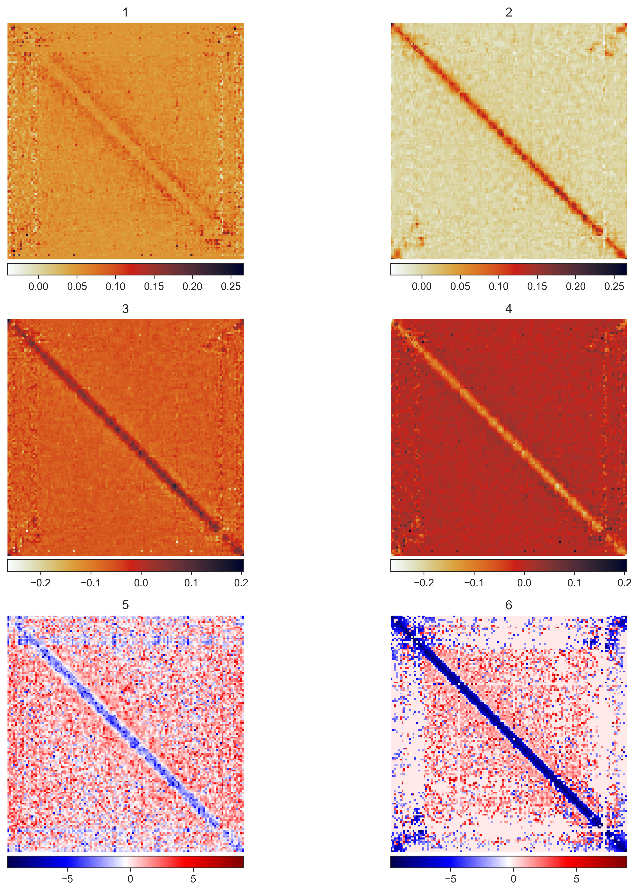

## all plots from hic experiments
this dir contains all the plots from following hic experiments. see the sample outputs below and their captions.

every experiment is outlined below, organized in sections by the data that was input. every data group had the following experiments conducted on it:
* `simple_diff` - takes simple diff of two hic matrices to expose areas of difference.
* `pca_hic` - applies pca to hic matrix1 and matrix2. reduces noise on the matrices before comparing them. includes stat to determine which window size best eliminates noise.
* `autoencoder_hic` - applies autoencoder to hic matrices to remove noise. autoencoder is trained on original matrix and used to denoise the query matrix. 

### dlbcl 
using data with chromatin conformation changes in B-cells of a diffuse large B-cell lymphoma (DLBCL) patient.
comparing chromosome 2 for differences with 3 Mb window size, stepping 100 kb. 

* original data

Figure 1  
caption:  
Figure 1.1: raw data of patient dlbcl sample from chess with red bounding boxes representing gained features from control sample  
Figure 1.2: raw data of control dlbcl sample from dlbcl with blue bounding boxes representing lost features that did not carry over to patient  

* `simple_diff`

Figure 2  
caption:   
Figure 2.1: simple diff of patient - control  
Figure 2.2: simple diff of control - patient  
Figure 2.3: log transformation of patient/control  
Figure 2.4: log transformation control/patient  

stats:  

* `pca_hic`

Figure 3  
caption:  
experiment used a 3x3 window size.  
Figure 3.1: PCA applied to on patient  
Figure 3.2: PCA applied to control  
Figure 3.3: Difference of PCA patient - control  
Figure 3.4: Difference of PCA control - patient  
Figure 3.5: log transformation of PCA applied patient/control  
Figure 3.6: log transformation of regular patient/control  

stats:  

* `autoencoder_hic`

Figure 4  
caption:  

stats:  

### synthetic data from GSE50199
[FreeHiC](https://github.com/yezhengSTAT/FreeHiC) generates a simulated version of the [Plasmodium falciparum genome Trophozoite stage](https://noble.gs.washington.edu/proj/plasmo3d/) based on the following [parameters](https://github.com/yezhengSTAT/FreeHiC/blob/master/FreeHiC_parameters). the simulated chr1 region is compared to the original chr1 region in this experiment. 

* original data

Figure 5  
caption:  
Figure 5.1: original data of GSE50199  
Figure 5.2: simulated GSE50199 based on changes in above parameters configuration  

stats:  

* `simple_diff`

Figure 6  
caption:  
Figure 6.1: diff of original - simulated  
Figure 6.2: diff of simulated - original  

stats:  

* `pca_hic` 

Figure 7  
experiment used a 5x5 window size.  
caption:  
Figure 7.1: pca applied to original  
Figure 7.2: pca applied to synthetic  
Figure 7.3: diff of pca applied original - simulated   
Figure 7.4: diff of pca applied simulated - original  
Figure 7.5: log2 of pca applied original / simulated  
Figure 7.6: log2 of pca applied simulated / original  

stats:  

* `autoencoder_hic`

Figure 8  
caption:  

stats:  

### noise added to dlbcl data
in this experiment, noise is added with gaussian blur layers to the dlbcl data. the experiments are conducted to see how well it removes the manually added noise.

* original data

Figure 9  
caption:  

stats:  

* `simple_diff`

Figure 10  
caption:  

stats:  

* `pca_hic` 

Figure 11  
caption:  

stats:  

* `autoencoder_hic`

Figure 12  
caption:  

stats:  