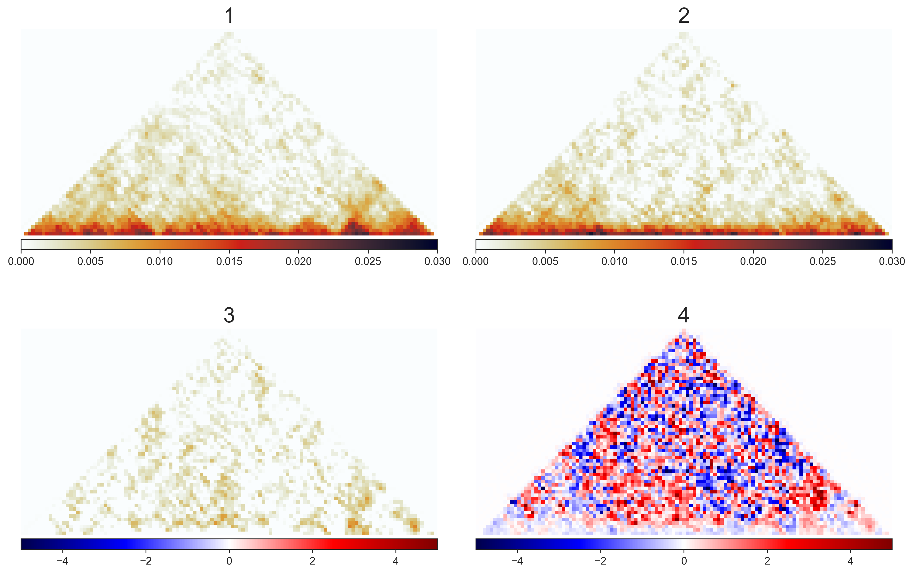

## autoencoder experiment for comparing hic data
applying autoencoder on hic matrices. comparing the observed and expected matrices

## running experiment
1. ensure venv is activated
2. run `jupyter notebok`
3. navigate to `autoencoder_hic.ipynb` and run notebook

notebook is expected to output:
