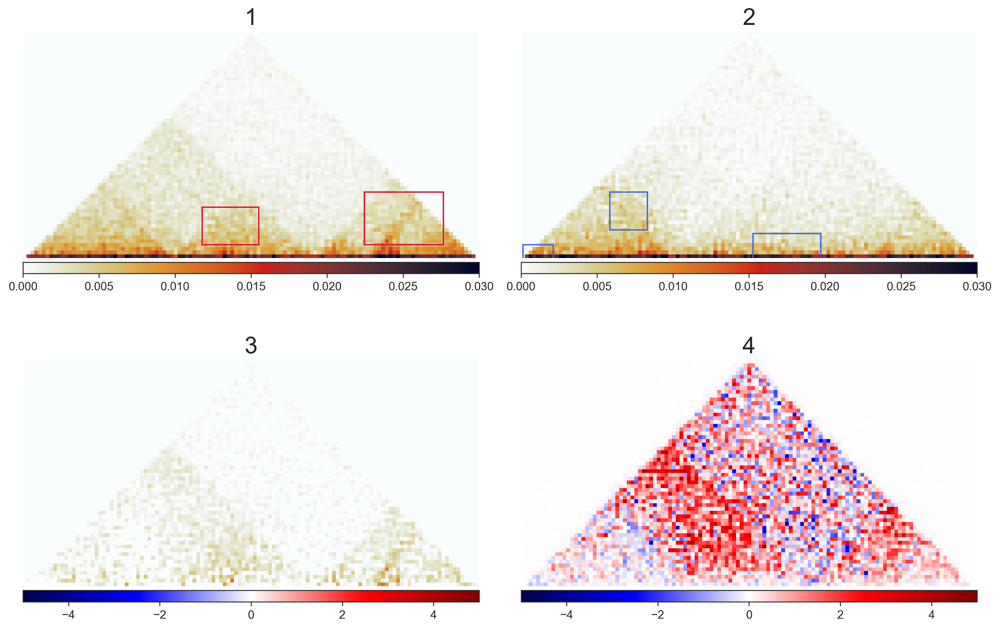

## simple diff experiment
take matrix difference (all entries in matrix A - B). Use this as a control to see what can be seen from taking a simple difference of matrices when comparing them.
compare this result to CHESS which uses more complex, normalization technique to determine differences

## running simple diff 
1. ensure venv is activated
2. run `jupyter notebok`
3. navigate to `basic_diff.ipynb` and run notebook

notebook is expected to output:
