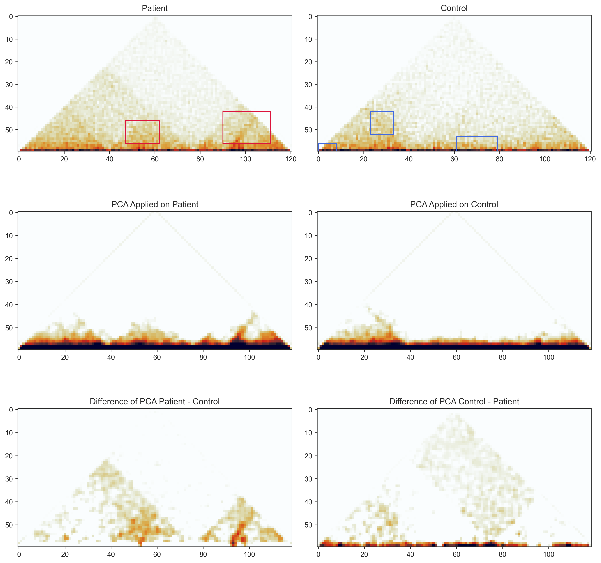

## pca on hic data experiment
taking the difference of two hic matrices with pca applied to each of them.

## running experiment
1. ensure venv is activated
2. run `jupyter notebok`
3. navigate to `pca_hic.ipynb` and run notebook

notebook is expected to output:
